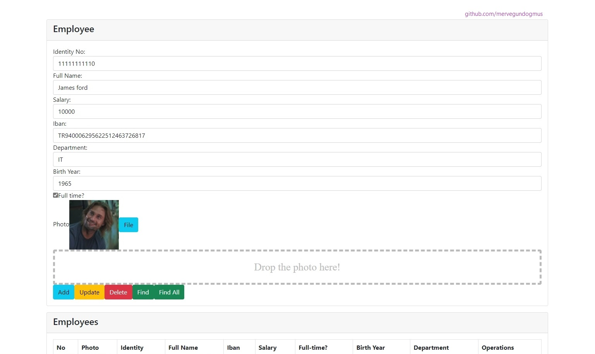
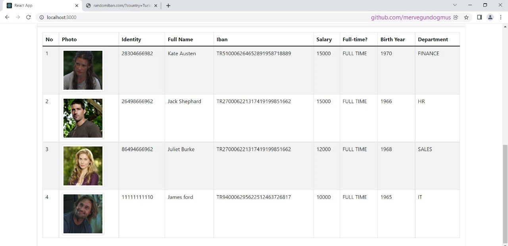

# Human-Resources-Project

## Implementing-MicroService-Architecture-using-Spring-Cloud

These project are created as part of the following training: "Implementing MicroService Architecture using Spring Cloud"

Please follow the link for the complete training catalog: https://www.deepcloudlabs.com/resources Instructor: Binnur Kurt

## Employee Operations Page

## Employee List Page

